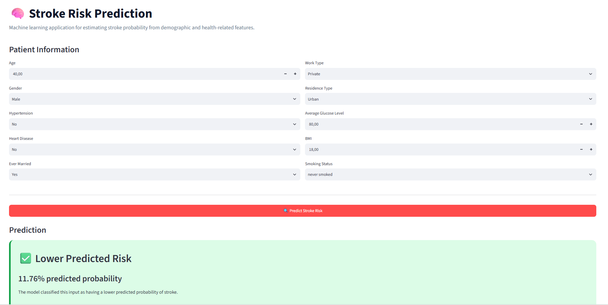

````markdown
# 🧠 Stroke Risk Prediction

A simple machine learning project that predicts the probability of stroke based on patient health and demographic information.

The project uses **Python, Scikit-learn, XGBoost, and Streamlit**.

## 📸 Application Screenshot




## 🚀 Features

- Patient information input form
- Stroke probability prediction
- Machine learning model comparison
- Class imbalance handling
- Prediction probability display
- Simple Streamlit web interface

## 🛠️ Technologies

- Python
- Pandas
- NumPy
- Scikit-learn
- XGBoost
- Streamlit
- Matplotlib
- Joblib

## 📂 Project Structure

```text
stroke-risk-prediction/
│
├── app.py
├── train.py
├── preprocess.py
├── evaluate.py
├── predict.py
├── requirements.txt
├── README.md
│
├── data/
│   └── healthcare-dataset-stroke-data.csv
│
├── models/
│   └── stroke_model.pkl
│
└── screenshots/
    └── streamlit-app.png
````

## 📊 Dataset

This project uses the **Stroke Prediction Dataset** from Kaggle.

Dataset:
https://www.kaggle.com/datasets/fedesoriano/stroke-prediction-dataset

The dataset contains information such as:

* Age
* Gender
* Hypertension
* Heart disease
* Average glucose level
* BMI
* Smoking status
* Work type
* Residence type

The target variable is `stroke`.

## ⚙️ Installation

Clone the repository:

```bash
git clone "link"
cd stroke-risk-prediction
```

Install the dependencies:

```bash
pip install -r requirements.txt
```

## 🧠 Train the Model

Make sure the dataset is located at:

```text
data/healthcare-dataset-stroke-data.csv
```

Then run:

```bash
python train.py
```

The trained model will be saved in:

```text
models/stroke_model.pkl
```

## 💻 Run the Streamlit App

```bash
streamlit run app.py
```

The application will open in your browser.

## 📈 Model Evaluation

The project evaluates models using metrics such as:

* Precision
* Recall
* F1-score
* ROC-AUC
* PR-AUC
* Confusion Matrix

Because stroke cases are much less common than non-stroke cases in the dataset, accuracy alone is not used as the main evaluation metric.

## ⚠️ Disclaimer

This project is for **educational and demonstration purposes only**.

It is not a medical diagnostic tool and should not be used to make healthcare or treatment decisions.
